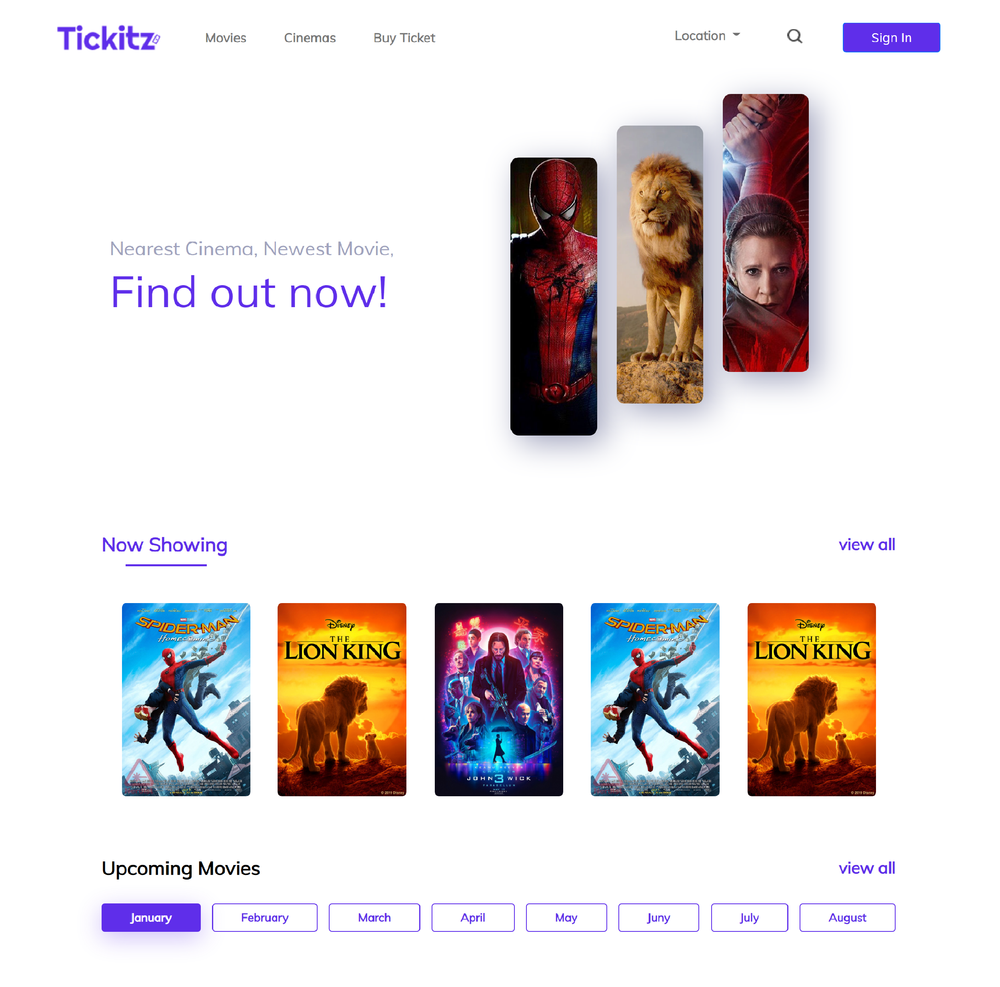

<h1 align='center'>Tickitz Responsive Website</h1>
  

    <a href="link_deploy">View Demo</a>
    ·
    <a href="https://github.com/rifqiziyad/Ticket-Kitz/issues">Report Bug</a>
    ·
    <a href="https://github.com/rifqiziyad/Ticket-Kitz/pulls">Request Feature</a>
  

## About The Project

#background_projek.

## Built With

## Getting Started

1. Download this Project or you can type `git clone https://github.com/rifqiziyad/Ticket-Kitz.git`
2. Open app's directory with your browser

## License

© [Rifqi Ziyad Imtinan](https://github.com/rifqiziyad/)
